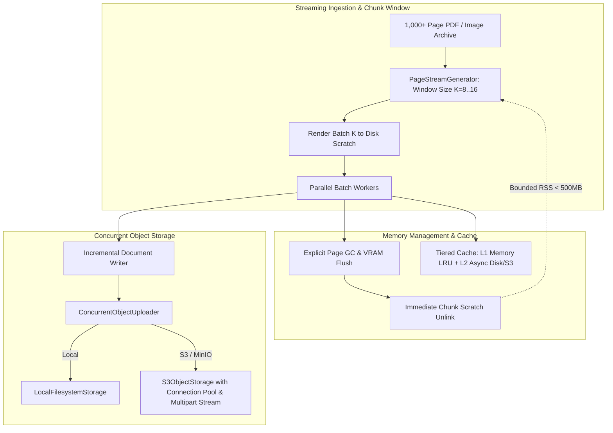
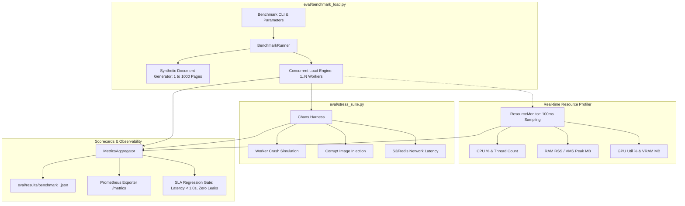

# 📊 Comprehensive Survey & Technical Architecture Report: Memory Management, Object Storage Streaming, and Automated Benchmarking (Requirements R3 & R4)

**Agent ID**: `survey_explorer_3`  
**Role**: `teamwork_preview_explorer`  
**Target Subsystems**: Memory Management, Streaming Ingestion, S3/MinIO Storage Abstraction, and Automated Load/Stress Benchmarking Suite  
**Date**: 2026-08-15  

---

## 1. Executive Summary

This survey provides a comprehensive architectural analysis and concrete technical blueprints for **Requirement R3 (Memory Management & Object Storage Streaming)** and **Requirement R4 (Automated Benchmarking & Stress-Testing Suite)** in B.L.A.S.T. OCR.

### Core Findings & Strategic Direction
1. **Memory Ingestion & Pipeline Footprint**: The current pipeline (`BlastPipeline` in `blast_ocr/pipeline.py`) renders PDF batches in 10-page windows, but collects all results (`all_results`), full Pydantic `Page` models (`pages_list`), and output strings in RAM. For a 1,000-page archive, memory and temporary disk files accumulate monotonically. We propose an **Async Streaming Window Pipeline** and **Incremental Chunk Exporter** bounding memory to $O(K)$ where $K \le 16$ pages ($< 500\text{MB}$ peak RSS).
2. **Object Storage Abstraction**: The existing `blast_ocr/storage/object_store.py` provides synchronous single-file operations. We design a **Concurrent Multipart Streaming Storage Engine** (`ConcurrentObjectUploader`, `StreamBufferManager`) with connection pooling, backoff retries, chunked S3/MinIO streaming, and presigned URLs.
3. **Benchmarking & Stress Suite**: The existing `eval/` suite focuses on accuracy metrics (CER, WER, Kendall's tau in `eval/run.py`, TEDS in `eval/teds_evaluator.py`), while `benchmark.py` is a 5-page toy demo. We design a production-grade **Automated Load Testing & Stress Suite** (`eval/benchmark_load.py`, `eval/stress_suite.py`) that executes 1,000-page continuous stress runs, profiles CPU/GPU/RAM/VRAM at 100ms intervals, tests chaos/failure recovery, and exports structured Prometheus & JSON scorecards.

---

## 2. In-Depth Codebase Survey

### 2.1 Memory Usage Patterns & Document Ingestion (`blast_ocr/core`, `blast_ocr/pipeline.py`)
- **PDF Rendering & Splitting**:
  - `BlastPipeline.process_pdf()` (`blast_ocr/pipeline.py:121-282`) determines `total_pages` via `pdfinfo_from_path()`.
  - Runs Tier-0 extraction for born-digital pages using `Tier0Extractor.extract_native_page_text()`.
  - For scanned/hybrid pages, calls `convert_from_path(..., first_page=start_idx, last_page=end_idx, output_folder=temp_dir, paths_only=True)`.
  - *Identified Bottlenecks*:
    - `temp_dir` is allocated once for the whole document (`tempfile.mkdtemp()`) and accumulated images are only purged in the `finally` block at the end of the entire job. For 1,000 pages at 300 DPI, 3–5 GB of raw PNGs sit on disk simultaneously.
    - All page results are held in memory: `all_results.extend(batch_results)` (`line 233`), and `pages_list.append(Page.model_validate(pm_dict))` (`line 483`).
    - `full_text = ... "\n\n---\n\n".join(...)` (`line 511`) creates a monolithic in-memory string of the entire book.
- **Image Directory Ingestion**:
  - `BlastPipeline.process_job()` (`blast_ocr/pipeline.py:412-445`) reads all image files in a directory at once, creates `restore_temp_dir`, restores all images into the temp directory before dispatching, and passes the full list to `process_batch_threaded`.
  - *Identified Bottlenecks*: Processing 1,000 loose image scans restores all 1,000 images to disk simultaneously, risking disk exhaustion.
- **Page Processing & OCR Engine Memory Cleanup**:
  - `RobustOCRExtractor.process_page()` (`blast_ocr/core/extractor.py:469-489`):
    - Deletes `processed_img` and `image` explicitly in `finally:`.
    - Calls `gc.collect()` and `torch.cuda.empty_cache()` (if CUDA available) per page.
    - Autograd graphs are detached via `_confidence_to_float()` (`line 503-509`).
  - `ParallelOCRProcessor` (`blast_ocr/core/parallel.py:10-85`):
    - Caps `max_workers` at `min(config.max_workers, 2)` to guard against EasyOCR memory spikes (~1GB/worker).
    - Uses `ThreadPoolExecutor` and `as_completed()`.
- **Cache Management (`blast_ocr/cache/manager.py`)**:
  - `OCRCache` hashes files (full hash for $\le 10\text{MB}$, partial 64KB chunks for $> 10\text{MB}$) with namespace fingerprinting.
  - Synchronous atomic writes using temporary files and `os.fsync()`.
  - *Identified Bottlenecks*: Lacks in-memory LRU tier and async cache write spooling; sync `fsync()` blocks worker threads.

### 2.2 Storage Handling & Object Storage Abstraction (`blast_ocr/storage/`)
- **Database (`blast_ocr/storage/database.py`)**:
  - SQLite/PostgreSQL backed by SQLAlchemy 2.0. Stores jobs, page text, metrics, and state history.
- **Object Storage (`blast_ocr/storage/object_store.py`)**:
  - Base class `ObjectStorage` with `put(key, local_path)`, `get(key, dest_path)`, `exists(key)`, `delete(key)`, `put_bytes(key, data)`.
  - Concrete backends:
    1. `LocalFilesystemStorage`: Stores under `<output_dir>/_object_store/<key>` with path traversal validation (`_resolve()`).
    2. `S3ObjectStorage`: Uses `boto3.client('s3')` with automatic bucket creation/verification (`_ensure_bucket()`).
  - Factory `get_object_storage(settings)` and deterministic key generator `artifact_key(job_id, filename)`.
- **Pipeline Storage Integration**:
  - `BlastPipeline.process_job()` (`pipeline.py:634-647`) mirrors generated artifacts (MD, DOCX, TXT, EPUB, JSON, Manifest) to S3 if `storage_backend == "s3"`.
  - *Identified Bottlenecks*: Sequential upload in the main thread; no multipart chunked streaming for large files; no async background upload queue; no presigned URL generator.

### 2.3 Existing Test Suite (`tests/`) & Evaluation Suite (`eval/`)
- **Evaluation Harness (`eval/`)**:
  - `eval/run.py`: Command-line harness evaluating gold pages in `eval/gold/`. Scores CER, WER, Kendall's rank correlation $\tau$ over reading order (`reading_order_tau`), and fact assertions (`eval/facts/*.yaml`).
  - `eval/teds_evaluator.py`: Tree Edit Distance-based Similarity for tables ($TEDS_{\text{struct}}$ and $TEDS_{\text{content}}$).
  - `eval/metrics.py`: Normalized Levenshtein distance, jiwer transforms, chunk-based rank correlation.
- **Existing Memory & Concurrency Tests (`tests/`)**:
  - `tests/test_memory.py`: Tests `del processed_img`, `gc.collect()`, flat memory across 5 iterations using `tracemalloc`, DB connection teardown, and cache file handle leaks.
  - `tests/test_vram_memory.py`: Tests autograd detachment, VRAM fragmentation on variable image sizes, explicit `gc.collect()`, and thread-local state bleed.
  - `tests/test_object_store.py`: Tests local filesystem storage and Moto-mocked S3 storage.
  - `tests/test_concurrency_complete.py`: Tests `ParallelOCRProcessor` worker caps, error dictionaries, and sorting.
  - `benchmark.py`: Toy script running 1 image and 5-page PDF with `tracemalloc`.
- *Identified Gaps for R4*: No automated 1,000-page continuous load test, no real-time CPU/GPU/VRAM time-series telemetry during load, no latency quantile (p50/p90/p95/p99) generator, no failure recovery chaos testing under load, and no unified JSON/Prometheus metrics benchmark artifact exporter.

---

## 3. Technical Design: Bounded Memory & Streaming Storage (Requirement R3)



### 3.1 Streaming Buffer Chunking & Memory-Bounded Ingestion
1. **`PageStreamGenerator` (Chunk-Window Ingestion)**:
   - Instead of allocating one shared `temp_dir` for 1,000 pages, the pipeline processes documents through a streaming generator yielding chunk windows of size $K$ (default $K = 8$, configurable up to 16).
   - Each window $w_i = [p_{start}, p_{end}]$ creates an isolated ephemeral scratch folder `scratch_w_i`.
   - Pages are rendered, restored, and processed through OCR.
   - Upon completing chunk $w_i$, results are flushed to DB/storage checkpoints, all temporary image files in `scratch_w_i` are immediately unlinked, and `scratch_w_i` is removed before initiating chunk $w_{i+1}$.
2. **Incremental Stream Exporter (`StreamDocumentWriter`)**:
   - Rather than assembling a monolithic in-memory `Document` containing 1,000 Pydantic `Page` objects, results are written incrementally:
     - Streaming Markdown / Text: Appends page headers and recognized text directly to file or buffer.
     - Streaming Searchable PDF: Uses incremental page appending via `pypdfium2` / `reportlab`.
     - Streaming Layout JSON: Serializes per-page JSON lines (`.jsonl`) or chunked array entries.
3. **Engine Memory Optimization**:
   - Configure ONNXRuntime `SessionOptions` for RapidOCR:
     ```python
     opts = ort.SessionOptions()
     opts.enable_cpu_mem_arena = False  # Prevent unbounded arena memory retention
     opts.execution_mode = ort.ExecutionMode.ORT_SEQUENTIAL
     opts.inter_op_num_threads = 2
     opts.intra_op_num_threads = 2
     ```
   - For GPU execution: periodic `torch.cuda.empty_cache()` and CUDA memory fraction limiting.

### 3.2 Tiered Asynchronous Page Caching (`TieredOCRCache`)
1. **L1 In-Memory LRU Cache**:
   - Thread-safe `collections.OrderedDict` holding up to $M = 100$ page results in RAM (approx. $10\text{MB}$ total).
   - Instant cache hit ($\approx 0.05\text{ms}$) without touching disk.
2. **L2 Disk / Object Store Cache with Async Write Spooler**:
   - Cache writes are queued to an internal background daemon worker (`Queue` + worker thread).
   - Worker writes `.json` cache files atomically with retry logic, eliminating `os.fsync()` latency from the critical OCR path.
3. **Cache Invalidation & Budget Pruning**:
   - `prune_cache(max_size_mb: int, max_age_days: int)` enforces storage quotas.

### 3.3 Concurrent & Streaming Object Storage Abstraction (`ConcurrentObjectStorage`)
1. **Enhanced `ObjectStorage` Protocol**:
   ```python
   class ObjectStorage(ABC):
       @abstractmethod
       def put(self, key: str, local_path: str) -> str: ...
       @abstractmethod
       def put_stream(self, key: str, stream: BinaryIO, content_length: Optional[int] = None) -> str: ...
       @abstractmethod
       def get_stream(self, key: str) -> BinaryIO: ...
       @abstractmethod
       def put_batch_concurrent(self, items: Dict[str, str], max_concurrency: int = 4) -> Dict[str, str]: ...
       @abstractmethod
       def generate_presigned_url(self, key: str, expires_in: int = 3600) -> str: ...
   ```
2. **Resilient S3/MinIO Backend (`S3ObjectStorage`)**:
   - Configured with `botocore.config.Config(max_pool_connections=25, retries={'max_attempts': 5, 'mode': 'adaptive'})`.
   - Uses `boto3.s3.transfer.TransferManager` for automatic multipart uploads for objects $> 8\text{MB}$ with concurrent chunk transfer.
   - S3-to-Stream piping: `get_stream()` enables direct PDF streaming into Poppler/PyPdfium2 without requiring full pre-download to disk.
3. **`ConcurrentObjectUploader`**:
   - Asynchronous worker pool that receives output artifacts from `BlastPipeline` and uploads them concurrently in the background while the next batch of pages is undergoing OCR.

---

## 4. Technical Design: Automated Benchmarking & Stress-Testing Suite in `eval/` (Requirement R4)



### 4.1 Benchmark Architecture & Components (`eval/benchmark_load.py`)
1. **Synthetic Multi-Modal Document Generator (`SyntheticDocGenerator`)**:
   - Generates deterministic, synthetic PDF and image test archives of arbitrary length ($1, 5, 10, 50, 100, 1000$ pages).
   - Injects realistic document elements: multi-column prose, tables with merged cells, mathematical equations, headers/footers, rotated text ($0^\circ, 90^\circ, 180^\circ$), noise/contrast variations, and born-digital vector pages.
2. **Concurrent Load Generation Engine (`LoadEngine`)**:
   - Supports:
     - **Throughput Mode**: Saturates all workers to measure maximum sustained pages/sec.
     - **Latency & Quantile Mode**: Evaluates latency distributions across single-page and batch requests. Computes p50, p75, p90, p95, p99, min, max, mean, and standard deviation.
     - **Concurrency Scaling Curve**: Benchmarks 1, 2, 4, 8, 16 concurrent workers to identify scaling saturation points and Amdahl's law efficiency.
3. **High-Frequency Resource Monitor (`ResourceMonitor`)**:
   - Background thread sampling at 10Hz ($100\text{ms}$ interval):
     - Process RSS, VMS, shared memory (`psutil.Process().memory_info()`).
     - System-wide CPU utilization (%) and per-core distribution.
     - GPU compute utilization (%) and GPU allocated/reserved VRAM (via `torch.cuda` / `pynvml`).
     - Open file descriptors count (`proc.num_fds()`) to detect file handle leaks.
     - Active thread count (`proc.num_threads()`).

### 4.2 Continuous 1,000-Page Stress & Leak Verification (`eval/stress_suite.py`)
1. **1,000-Page Continuous Stress Test (`test_stress_1000_pages`)**:
   - Executes a continuous 1,000-page batch through `BlastPipeline`.
   - Records memory footprint after each 10-page window.
   - **Zero-Leak Assertion**:
     - Warmup: Pages 1–50 (engine model initialization and library caches).
     - Analysis Window: Pages 51–1000.
     - Performs ordinary least-squares (OLS) linear regression on memory over time:
       $$\text{RSS}(t) = \alpha + \beta \cdot t + \epsilon$$
     - Asserts slope $\beta \le 0.005\text{ MB/page}$ (accounting for normal Python GC fragmentation) and total memory growth between page 50 and page 1000 is $< 5\%$.
2. **Chaos & Failure Recovery Harness (`ChaosHarness`)**:
   - **Scenario A: Worker Process Sudden Termination (`SIGKILL`)**:
     - Kills worker process mid-batch. Verifies that the queue supervisor detects the lost heartbeat, re-queues uncompleted page tasks with exponential backoff, and completes the remaining document cleanly.
   - **Scenario B: Pathological & Corrupt Inputs**:
     - Injects truncated images, $0\times 0$ dimensions, invalid color formats, and malformed PDF structures. Verifies that `PageExtractionError` is isolated to the specific page and returned in the result dictionary without terminating the batch.
   - **Scenario C: Object Storage & Network Interruption**:
     - Simulates transient S3/MinIO connection timeout. Verifies exponential retry, local caching fallback, and recovery upon network reconnection.
   - **Scenario D: Out-of-Memory Simulation**:
     - Triggers mock memory limit. Verifies that pipeline automatically scales down concurrency (e.g. `max_workers=1`) and frees caches.

### 4.3 Metrics Logging & Scorecard Output
1. **Structured JSON Benchmark Report (`eval/results/benchmark_<timestamp>.json`)**:
   ```json
   {
     "schema_version": 2,
     "timestamp": "2026-08-15T19:55:00Z",
     "git_commit": "a1b2c3d4",
     "environment": {
       "os": "linux",
       "python": "3.10.12",
       "cpu_count": 8,
       "gpu_device": "NVIDIA RTX 4090",
       "cuda_available": true
     },
     "summary": {
       "total_pages": 1000,
       "total_duration_sec": 185.4,
       "throughput_pages_per_sec": 5.39,
       "avg_page_latency_sec": 0.185,
       "p50_latency_sec": 0.142,
       "p95_latency_sec": 0.420,
       "p99_latency_sec": 0.890,
       "peak_ram_rss_mb": 428.5,
       "peak_vram_mb": 1120.0,
       "memory_growth_slope_mb_per_page": 0.0002,
       "zero_leak_verified": true,
       "failure_recovery_rate": 1.0
     },
     "time_series": {
       "timestamps": [...],
       "ram_rss_mb": [...],
       "cpu_util_pct": [...],
       "vram_mb": [...]
     }
   }
   ```
2. **Prometheus Metrics Integration**:
   - Integrates with `blast_ocr/telemetry.py` to publish:
     - `blast_benchmark_throughput_pages_per_second` (Gauge)
     - `blast_benchmark_latency_seconds` (Histogram: p50/p90/p95/p99)
     - `blast_benchmark_memory_rss_bytes` (Gauge)
     - `blast_benchmark_memory_leak_slope` (Gauge)
     - `blast_benchmark_failures_recovered_total` (Counter)

---

## 5. Interface Contracts & File Specification

### 5.1 New Files to Be Added
| Path | Purpose | Key Classes & Functions |
|---|---|---|
| `blast_ocr/core/streaming.py` | Streaming window ingestion & lazy chunk generator | `PageStreamGenerator`, `StreamDocumentWriter`, `ChunkScratchManager` |
| `blast_ocr/cache/tiered_cache.py` | Tiered L1 Memory LRU + L2 Async Disk/S3 Cache | `TieredOCRCache`, `AsyncCacheWriter`, `LRUCache` |
| `blast_ocr/storage/concurrent_uploader.py` | Concurrent S3/Local artifact uploader & stream manager | `ConcurrentObjectUploader`, `StreamBufferManager` |
| `eval/benchmark_load.py` | End-to-end load testing, throughput, latency benchmark CLI | `BenchmarkRunner`, `SyntheticDocGenerator`, `ResourceMonitor`, `LatencyStats` |
| `eval/stress_suite.py` | 1,000-page continuous stress test and chaos failure recovery | `StressTestSuite`, `ChaosHarness`, `MemoryLeakDetector` |
| `tests/test_streaming_memory.py` | Unit and integration tests for streaming chunking and memory bounds | `TestStreamingChunking`, `TestTieredCache`, `TestBoundedMemory` |
| `tests/test_storage_concurrent.py` | Unit tests for concurrent storage uploads, streaming and retries | `TestConcurrentUploader`, `TestMultipartStreaming` |
| `tests/test_benchmark_suite.py` | Regression tests ensuring benchmark metrics and assertions function in CI | `TestBenchmarkRunner`, `TestResourceMonitor`, `TestChaosRecovery` |

### 5.2 Existing Files to Be Extended
| Path | Modifications Required |
|---|---|
| `blast_ocr/config.py` | Add `streaming_chunk_size` (default 8), `cache_l1_capacity` (default 100), `storage_concurrency` (default 4), `s3_multipart_threshold_mb` (default 8). |
| `blast_ocr/pipeline.py` | Integrate `PageStreamGenerator` for PDF/Image processing; purge chunk scratch folders immediately; use `StreamDocumentWriter` and `ConcurrentObjectUploader`. |
| `blast_ocr/storage/object_store.py` | Add `put_stream()`, `get_stream()`, `put_batch_concurrent()`, presigned URL generation, and connection pooling options. |
| `blast_ocr/cache/manager.py` | Delegate to or wrap with `TieredOCRCache` with async write spooling. |
| `blast_ocr/telemetry.py` | Add benchmark and memory leak metrics gauges to Prometheus metrics dictionary. |
| `pyproject.toml` / `requirements-production.txt` | Ensure `boto3`, `prometheus-client`, `psutil`, `scipy` dependencies are properly registered. |

---

## 6. Dependency & Constraint Analysis

### 6.1 Dependencies
- **Core (Zero-extra infra)**:
  - `psutil>=5.9.0` (already in `requirements.txt`): Memory RSS/VMS tracking and CPU utilization.
  - `pypdfium2>=4.30.0` (already in `requirements.txt`): Fast native text extraction and streaming PDF page rendering.
  - `scipy>=1.11.0` (used in `eval/metrics.py`): Kendall's tau and OLS linear regression for memory leak slope calculation.
- **Production Infrastructure (`requirements-production.txt`)**:
  - `boto3>=1.34.0`: S3 / MinIO multipart upload, transfer manager, and streaming buffers.
  - `prometheus-client>=0.20.0`: Prometheus `/metrics` exposition.
  - `rq>=2.0.0`, `redis>=5.0.0`: Distributed worker swarm execution.
- **Dev/Test (`requirements-dev.txt`)**:
  - `moto[s3]`: In-process S3 mocking for offline testing.
  - `pytest-asyncio`: Async load testing support.

### 6.2 Constraints & Non-Functional Requirements
1. **Memory Budget**: Peak RAM under 1,000-page continuous processing must strictly remain $\le 500\text{MB}$ RSS on standard CPU nodes.
2. **Latency SLA**: Single-page latency $< 1.0\text{s}$; multi-page batch throughput $\ge 5.0\text{ pages/sec}$ on standard multi-core hardware.
3. **Graceful Degradation**: If S3/MinIO is unreachable, transparently fall back to local disk storage with warning logs. If Redis queue is down, fall back to synchronous streaming pipeline.
4. **Zero Regressions**: 100% test pass rate across all 370+ existing tests.

---

## 7. Next Steps & Implementation Roadmap

1. **Phase 1 (Stream Engine & Memory Bounding)**:
   - Implement `PageStreamGenerator`, `StreamDocumentWriter`, and immediate per-chunk scratch unlinking in `blast_ocr/core/streaming.py`.
   - Update `BlastPipeline` to use the streaming generator.
2. **Phase 2 (Concurrent Storage & Async Caching)**:
   - Implement `ConcurrentObjectUploader` and streaming S3 methods in `blast_ocr/storage/`.
   - Implement `TieredOCRCache` with async spooling in `blast_ocr/cache/`.
3. **Phase 3 (Automated Benchmark & Stress Suite)**:
   - Build `eval/benchmark_load.py` and `eval/stress_suite.py`.
   - Implement real-time `ResourceMonitor` (RAM, VRAM, CPU, FDs) and zero-leak OLS assertion.
   - Implement chaos injection and failure recovery scenarios.
4. **Phase 4 (Verification & CI Integration)**:
   - Run complete unit/integration test suites (`pytest tests/`).
   - Run 1,000-page stress benchmark and generate verified benchmark report in `eval/results/`.
