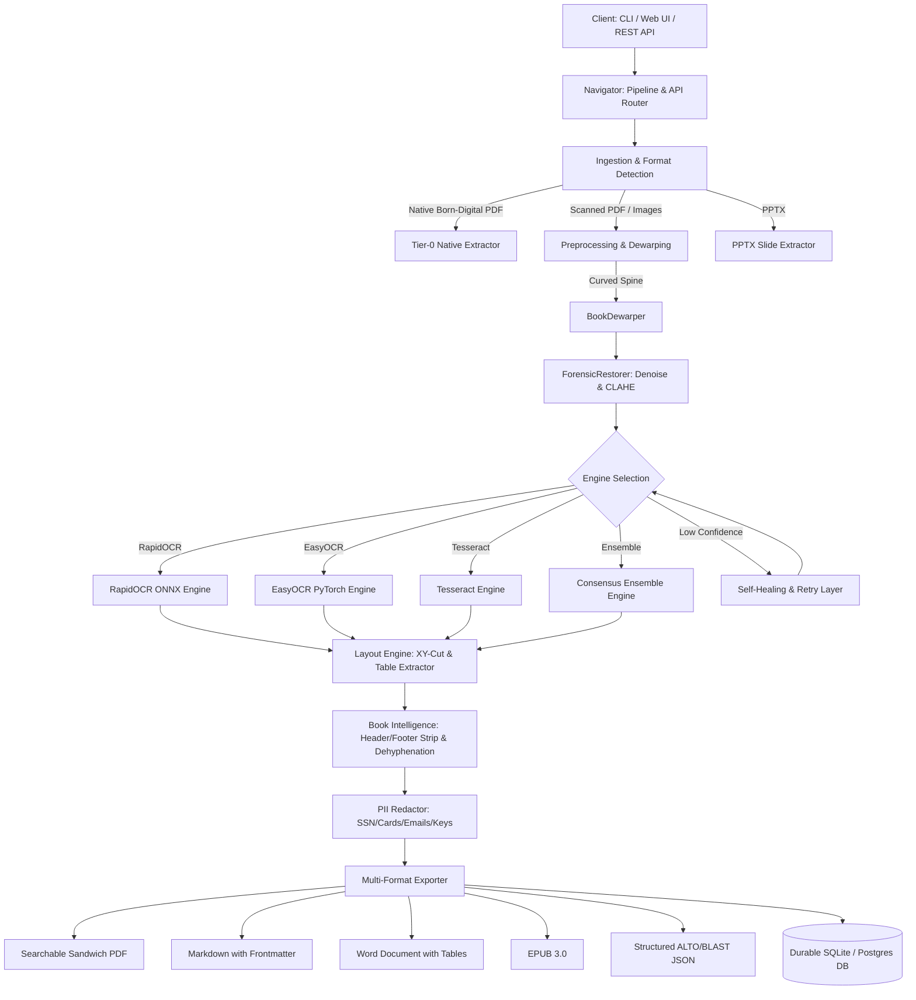

# 🏗️ B.L.A.S.T. Architecture Guide (Production Edition)

This document outlines the high-level design and internal mechanics of the **B.L.A.S.T.** Production OCR Engine.

## The A.N.T. Philosophy

The system is built upon the **3-Layer A.N.T.** (Architect, Navigator, Tool) design pattern:

### Layer 1: Architect (The "Why")
- **Responsibility**: Defines protocols, schemas, data models, and SOPs.
- **Location**: `architecture/`, `blast_ocr/core/models.py`, `blast_ocr/core/document_model.py`, and `gemini.md` (Source of Truth).
- **Role**: The brain involving decision-making logic, immutable configuration isolation, and standard data schemas.

### Layer 2: Navigator (The "Where")
- **Responsibility**: Routing, validation, queue orchestration, and control flow.
- **Location**: `blast_ocr/main.py`, `blast_ocr/pipeline.py`, `blast_ocr/cli.py`, and `blast_ocr/api/`.
- **Role**: The central nervous system. It receives input (via CLI, Web GUI, or REST API), routes to appropriate tools, handles retries, and coordinates export.

### Layer 3: Tool (The "How")
- **Responsibility**: Atomic, deterministic execution modules.
- **Location**: `blast_ocr/core/`.
- **Core Modules**:
  - `SearchablePDFGenerator`: Creates dual-layer vector/bitmap searchable PDFs with invisible selectable text.
  - `TableExtractor`: Detects bordered and borderless tables into Markdown, HTML, and DOCX matrices.
  - `BookDewarper`: Computes polynomial baseline curvature displacement meshes to flatten curved book spines.
  - `ForensicRestorer`: Adaptive Gaussian denoising, CLAHE, and enterprise PII redaction.
  - `LayoutEngine`: Recursive XY-Cut reading order sorting and line clustering.
  - `BookProcessor`: Running header/footer fuzzy removal, cross-line dehyphenation, paragraph reflow, and EPUB export.
  - `Engines`: Pluggable adapters (`RapidOCREngine`, `EasyOCREngine`, `TesseractEngine`, `ConsensusEnsembleEngine`).

---

## 🔄 Production Data Flow

## 🧩 Module Dictionary

| Module | Path | Description |
|--------|------|-------------|
| **Core Extractor** | `blast_ocr/core/extractor.py` | Engine wrapper, glyph height estimation, image loading. |
| **Searchable PDF** | `blast_ocr/core/searchable_pdf.py` | Dual-layer Sandwich PDF generation with PyMuPDF/ReportLab. |
| **Table Extractor** | `blast_ocr/core/table_extractor.py` | Morphological table detection, cell grid parsing, Markdown/HTML/DOCX formatting. |
| **Book Dewarp** | `blast_ocr/core/book_dewarp.py` | Cylindrical baseline curvature detection and remapping. |
| **Book Intelligence** | `blast_ocr/core/book_intelligence.py` | Header/footer suppression, cross-line dehyphenation, EPUB export. |
| **REST API** | `blast_ocr/api/` | Enterprise FastAPI server with OpenAPI docs, health, and metrics. |
| **CLI Powerhouse** | `blast_ocr/cli.py` | Rich terminal interface with progress bars and JSON mode. |
| **Engines** | `blast_ocr/core/engines/` | RapidOCR, EasyOCR, Tesseract, and Consensus Ensemble adapters. |
| **Database** | `blast_ocr/storage/database.py` | SQLAlchemy ORM models and migrations for tracking jobs and metrics. |
| **Cache** | `blast_ocr/cache/manager.py` | Hash-based caching preventing re-processing of identical images. |
