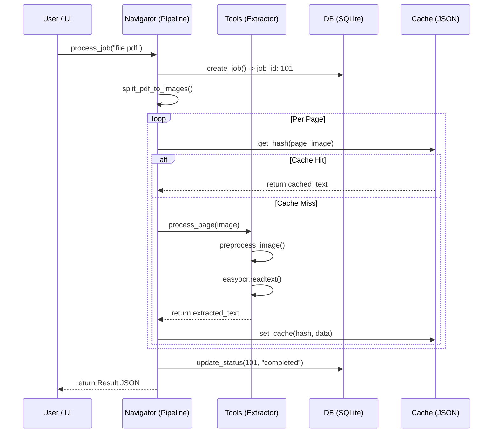
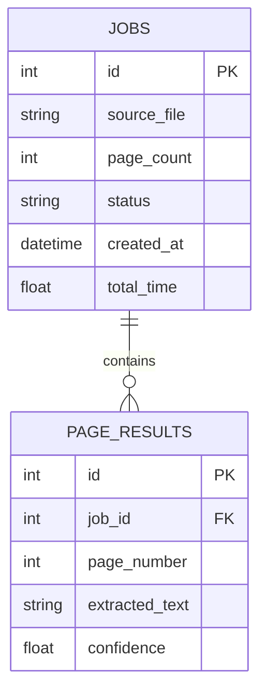

# 🏗️ Architecture Deep Dive

B.L.A.S.T. follows a **3-Layer A.N.T.** (Architect, Navigator, Tool) design pattern. This ensures that high-level orchestration never mixes with low-level pixel manipulation.

## 1. The 3-Layer Model

### Layer 1: Architect (The "Why")
-   **File Storage**: `architecture/`, `gemini.md`.
-   **Goal**: Define the "rules of engagement." Schema definitions, error code taxonomies, and the **B.L.A.S.T. Protocol**.
-   **Interaction**: This layer is static; it dictates how layers 2 and 3 must behave.

### Layer 2: Navigator (The "Where")
-   **Implementation**: `blast_ocr/pipeline.py`.
-   **Goal**: Orchestration and state management.
-   **Interaction**: Receives a `source_path`, initializes the DB job, manages the temporary workspace, and handles high-level "Job Failed" vs "Job Success" states.

### Layer 3: Tool (The "How")
-   **Implementation**: `blast_ocr/core/`.
-   **Goal**: Atomic execution.
-   **Specializations**:
    -   `extractor.py`: Low-level OCR calls and image preprocessing.
    -   `healing.py`: The retry loop and backoff logic.
    -   `parallel.py`: Thread pool management and worker distribution.

---

## 🔄 Sequence Diagram: OCR Lifecycle

---

## 🧵 Threading & Concurrency Model

B.L.A.S.T. uses a **Hybrid Serialization Strategy**:

1.  **IO-Bound Parallelism**: `pdf2image` and file reads happen in parallel using a `ThreadPoolExecutor`.
2.  **CPU/GPU Serialization**: `EasyOCR` is internally thread-unsafe and memory-heavy. We enforce serialization using a **Module-Level Global Lock** (`_ocr_global_lock`) in `extractor.py`.
3.  **Isolation**: Each worker thread possesses a thread-local database session via `scoped_session`, preventing transaction poisoning during concurrent commits.

## 📊 Database ERD (Entity Relationship Diagram)

---

## 🔗 Next Steps
-   [Performance Tuning](PERFORMANCE_TUNING.md)
-   [API Reference](API_REFERENCE.md)

---

## 🔌 OCR Backend Coupling Notes

Current architecture is EasyOCR-first in Layer 3 (`blast_ocr/core/extractor.py`) with a stable pipeline/UI contract built around extractor output.

Before changing engines:

- Preserve extractor output schema (`page`, `text`, `confidence`, `bbox_count`, `details`).
- Keep concurrency controls (`_ocr_global_lock`, worker singleton initialization) until equivalent safety is validated for the new backend.
- Validate cloud startup and model bootstrap behavior separately from local inference behavior.

For migration sequencing and rollback controls, see `docs/OCR_ENGINE_TRANSITION_PLAYBOOK.md`.
