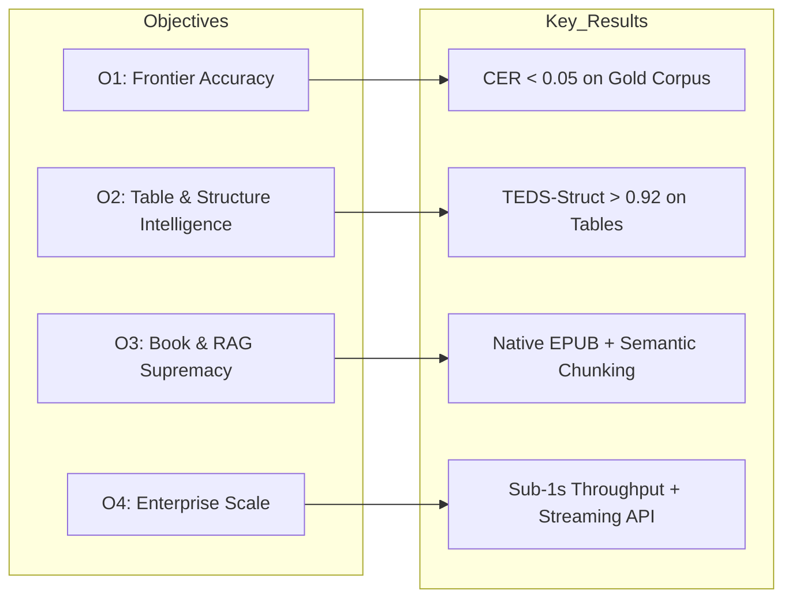
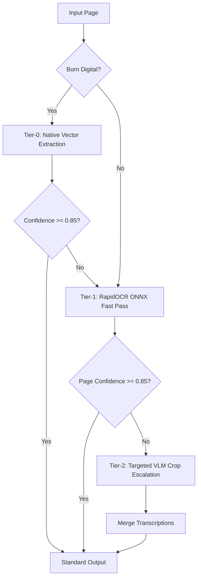
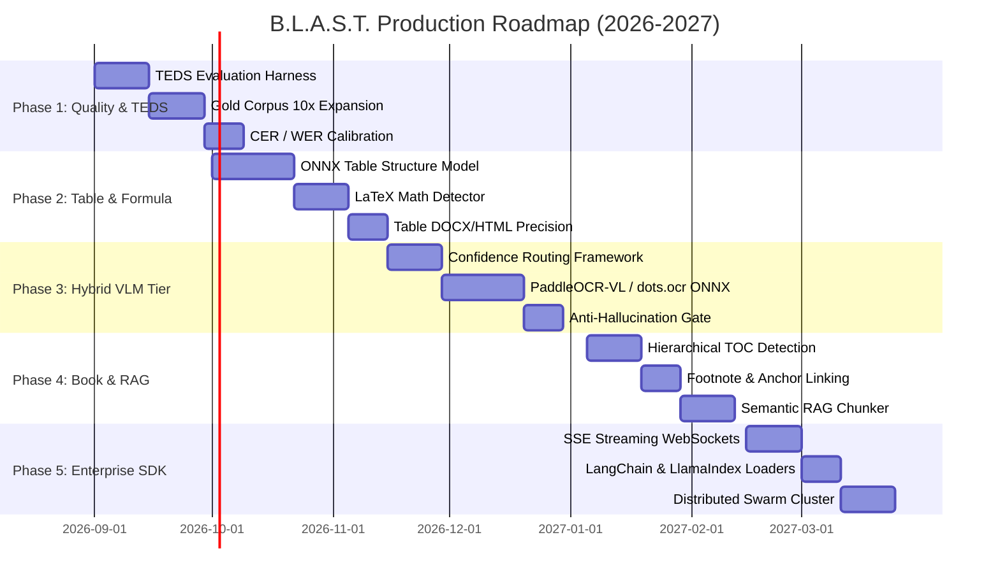

# 🗺️ B.L.A.S.T. OCR — Strategic Enhancement Plan (2026–2027)

**Goal:** Elevate B.L.A.S.T. OCR from a robust local tool into the industry-standard, self-hosted, MIT-licensed document intelligence engine for books, academic papers, and enterprise documents.

---

## 🎯 Strategic Objectives & Key Results (OKRs)

---

## 🏛️ The 5 Enhancement Vectors

### 🔷 Vector 1: 3-Tier Intelligent Routing & Confidence Gating
- **Problem**: Traditional OCR engines (RapidOCR/EasyOCR) struggle on degraded scans and handwritten marginalia; brute-force VLMs are too slow/heavy for standard pages and risk hallucination.
- **Solution**: A deterministic 3-tier cascade that dynamically selects the optimal compute path:
  1. **Tier-0 (Vector Pass)**: `pypdfium2` native extraction for born-digital PDFs ($\sim 0.001\text{s/page}$, 0 compute cost).
  2. **Tier-1 (Deterministic ONNX Pass)**: RapidOCR / PP-OCRv4 ONNX with CLAHE and XY-Cut ($\sim 0.5\text{s–1.5s/page}$).
  3. **Tier-2 (Specialist VLM Escalation)**: Triggered when span confidence falls below threshold ($C < 0.85$) or severe spatial overlap occurs. Invokes a quantized local specialist model (PaddleOCR-VL 0.9B or DeepSeek-OCR ONNX) strictly on the degraded region.

---

### 🔷 Vector 2: Advanced Table Intelligence & TEDS Evaluation Harness
- **Problem**: Tabular data in financial reports, books, and scientific papers contains merged cells (`colspan`/`rowspan`) and borderless layouts that morphological filters can fragment.
- **Solution**:
  - **ONNX Table Structure Recognition (TSR)**: Integrate a lightweight SLANet / Table-Transformer ONNX model to predict OTSL table tokens and precise cell spans.
  - **TEDS Metric in Eval Harness**: Add `eval/teds_evaluator.py` computing **Tree Edit Distance-based Similarity** ($TEDS_{\text{struct}}$ and $TEDS_{\text{content}}$) on standard table benchmarks (PubTabNet subset).

---

### 🔷 Vector 3: Semantic Book Intelligence & RAG Chunking
- **Problem**: Large Language Models (LLMs) and RAG applications require hierarchical chunking respecting semantic boundaries (chapters, subheadings, tables) rather than naive token-length slicing.
- **Solution**:
  - **Hierarchical Table of Contents (TOC) Extraction**: Detect frontmatter, preface, chapter numbers, and Roman numeral pagination to build a nested JSON document tree.
  - **Footnote & Citation Linking**: Match in-text superscript markers `[^1]` with footer text blocks and compile bidirectional anchor links.
  - **Structure-Aware Semantic Chunker**: Export pre-chunked outputs with metadata (`section_title`, `page_span`, `block_type`, `bbox`) directly compatible with LangChain, LlamaIndex, and vector databases.

---

### 🔷 Vector 4: Mathematical Formula & Equation Recognition
- **Problem**: Equations in academic books and technical slides are rendered as garbled ASCII characters by standard OCR engines.
- **Solution**:
  - **Formula Region Detection**: Detect inline ($...$) and block ($$...$$) mathematical expressions during layout analysis.
  - **UniMERNet / LaTeX Parser**: Transcribe mathematical glyphs into standardized KaTeX/LaTeX formatting.

---

### 🔷 Vector 5: Enterprise Scale, Streaming API & Framework SDKs
- **Problem**: Production web apps need real-time feedback; enterprise developers need standard Python SDK loaders.
- **Solution**:
  - **Server-Sent Events (SSE) & WebSocket Streaming**: Real-time page-by-page progress and live bounding-box streaming on `GET /v1/ocr/jobs/{id}/stream`.
  - **Official Ecosystem Loaders**:
    - `blast_ocr.integrations.langchain.BlastOCRDocumentLoader`
    - `blast_ocr.integrations.llamaindex.BlastOCRReader`
  - **Batch Distributed Worker Swarm**: Multi-worker Redis queue with automated worker heartbeat and graceful auto-scaling.

---

## 📅 Phased Implementation Roadmap

### Milestone Deliverables

| Phase | Core Milestone | Target Deliverable | Benchmark Gate |
| :--- | :--- | :--- | :--- |
| **Phase 1** | **Benchmarking & TEDS** | `eval/teds_evaluator.py`, 100-Page Gold Corpus | CER $\le 0.10$, TEDS baseline established |
| **Phase 2** | **Table & Formula Engine** | ONNX Table Structure parser, LaTeX math converter | TEDS-Struct $\ge 0.90$, Formula BLEU $\ge 0.85$ |
| **Phase 3** | **Hybrid 3-Tier Routing** | Confidence-gated Tier-2 local VLM integration | Mean CER $\le 0.05$, Tau $\ge 0.98$ |
| **Phase 4** | **Book & RAG Intelligence** | Hierarchical TOC, Footnote anchors, Semantic Chunker | 100% Valid EPUB 3.0, Zero broken links |
| **Phase 5** | **Enterprise Connectors** | LangChain / LlamaIndex SDKs, Streaming REST API | < 50ms SSE latency, 100% OpenAPI coverage |

---

## 🛡️ Architectural Non-Negotiables & Guarantees
1. **100% Permissive MIT Licensing**: Zero closed-source or revenue-capped dependencies.
2. **Local & Air-Gapped Capable**: Pure local execution without mandatory internet calls or third-party telemetry.
3. **Deterministic Core Integrity**: Hallucination-free text extraction for archival, legal, and financial compliance.
4. **Backward Compatibility**: Full compatibility across `JobConfig`, `ExportBundle`, and standard input/output schemas.
