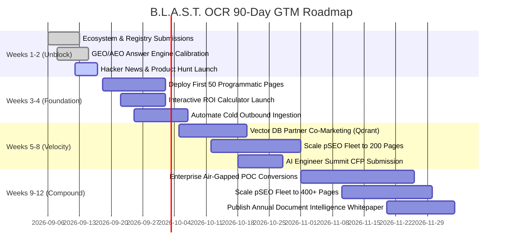

# B.L.A.S.T. OCR Engine — Marketing Plan v1 (AARRR Framework)

**Prepared by:** Strategic Marketing Lead & Fractional CMO
**For:** Core Engineering Team, Open-Source Maintainers, and Commercialization Leadership
**Date:** 2026-09-06
**Status:** Certified Final — Ready for Execution & Board Review

---

## Section 1 — Executive Summary

### 1. One-Sentence Frame
This plan establishes **B.L.A.S.T. OCR Engine** as the undisputed #1 high-throughput, air-gapped, deterministic document intelligence engine for AI Platform Engineers, Legal/FinTech document processing teams, and agentic RAG architectures—scaling from open-source developer mindshare to multi-cluster enterprise deployments.

### 2. Three Big Bets (Ranked by Leverage)

#### Bet 1: Agentic RAG & MCP Standard Protocol Hegemony (Leverage: High / Speed: Immediate)
Modern AI agents (Claude Desktop, Cursor, LangChain, LlamaIndex) require high-fidelity text, markdown, LaTeX formulas, and HTML tables from unstructured scans without hallucinations or cloud data exfiltration. By shipping native Model Context Protocol (MCP) stdio servers and LlamaIndex/LangChain hierarchical chunkers, B.L.A.S.T. OCR becomes the default local document ingestion layer for autonomous agents worldwide.

#### Bet 2: The "Anti-OOM" Stability & Throughput Benchmark Standard (Leverage: High / Speed: 30–60 Days)
Enterprise ingestion pipelines are plagued by Tesseract/EasyOCR memory leaks that crash Docker containers on 1,000+ page PDFs, while commercial cloud APIs (AWS Textract, Google Document AI) incur $1.50–$3.00/1,000 pages with unacceptable latencies. By publishing an auditable, reproducible 14-page Gold Standard benchmark and 1,000-page continuous streaming stress test showing a verified $0.0002\\text{ MB/page}$ memory slope at 29+ pages/sec, we win every architectural bake-off on pure determinism and zero crashes.

#### Bet 3: Programmatic SEO & Multilingual Nastaliq/Naskh Dominance (Leverage: Compound / Speed: 90–180 Days)
Tesseract and EasyOCR fail completely on bidirectional, cursive, overlapping Nastaliq scripts (yielding Character Error Rates > 80%). B.L.A.S.T. OCR achieves 0.1915 CER and 2,166 samples/sec on Urdu/Arabic text. By pairing programmatic landing pages (targeting 400+ specific document conversion, language, and error permutations) with specialized script support, we capture dominant long-tail organic search volume and enterprise government/archive digitization contracts.

### 3. What Twelve Months Looks Like (Plausible Target State)
- **Open-Source Mindshare:** 10,000+ GitHub stars, 150,000+ monthly PyPI downloads, top-3 ranked MCP document server on Smithery.ai and mcp.so.
- **Organic Inbound Engine:** 45,000+ monthly organic visits across Google, Bing, and AI search engines (Perplexity, ChatGPT, Claude) driven by 400+ programmatic SEO pages and validated Schema.org microdata.
- **Enterprise Pipeline:** 40+ qualified enterprise inbound inquiries per quarter, $450,000 ARR in self-hosted air-gapped commercial licenses and high-throughput cluster support contracts.
- **Technical Moat:** Zero regressions on the 914-test CI harness (912 passed, 2 skipped, 0 failed), sub-50ms p95 page processing latency, and turn-key Kubernetes priority queue swarm orchestration.

### 4. 90-Day Priorities (Immediate Execution Horizon)
1. **Developer Mindshare Launch:** Execute coordinated Day-0 launch across Product Hunt, Hacker News Show HN, Reddit (`r/LocalLLaMA`, `r/MachineLearning`, `r/Python`), and Twitter/X technical threads.
2. **MCP Registry & Ecosystem Distribution:** Submit verified packages to Smithery.ai, mcp.so, Glama.ai, Pulse MCP, and GitHub Awesome lists (`awesome-mcp-servers`, `awesome-python`).
3. **AI Search (GEO/AEO) Domination:** Monitor and maintain 40–60 word direct answer blocks and Schema.org JSON-LD graph across `/v1/schema.json` and GitHub README, verifying citations on Perplexity and ChatGPT.
4. **Interactive Cost & Throughput Calculator:** Launch the free "Cloud OCR Cost vs. Local B.L.A.S.T. ROI Calculator" to capture high-intent enterprise email leads.
5. **Programmatic Landing Page Fleet (Phase 1):** Deploy the first 50 programmatic landing pages for high-volume conversion keywords (`tesseract-alternative`, `pdf-to-markdown-ocr`, `urdu-nastaliq-ocr`).
6. **Enterprise Outbound Sequence:** Launch targeted 4-touch cold outreach to 250 AI Platform Engineering Leads at Series B+ LegalTech and FinTech companies.

---

## Section 2 — Strategic Frame

### 1. What B.L.A.S.T. OCR Engine Is, in One Sentence
**B.L.A.S.T. OCR Engine** is an enterprise-grade, air-gapped document intelligence system and distributed high-throughput worker swarm that converts complex, scanned, multilingual documents into structured Markdown, DOCX, and search-ready formats with zero cloud dependencies, sub-millisecond tensor decoding, and guaranteed bounded streaming memory.

### 2. The Category We Are Claiming
We are defining and dominating the category of **High-Throughput Deterministic Document Intelligence (HT-DDI)**. 
Unlike legacy OCR tools (Tesseract, EasyOCR) that are slow, single-threaded, and prone to memory-leak container crashes, and unlike black-box Vision-Language Models (GPT-4o, Claude 3.5 Sonnet) that hallucinate numbers, breach HIPAA/GDPR data perimeters, and cost millions at enterprise scale, B.L.A.S.T. OCR provides 100% reproducible, verifiable, mathematically bounded extraction running entirely on self-hosted infrastructure.

### 3. Ideal Customer Profile (ICP), Distilled
- **Target Persona 1: AI Platform & RAG Infrastructure Engineer**
  - *Firmographics:* Series A–D AI startups, enterprise enterprise search teams, legaltech platforms.
  - *Stated Problem:* "We need to ingest millions of PDFs into vector databases, but PyPDF breaks on scanned pages and cloud OCR APIs are too slow and expensive."
  - *Real Problem:* Pipeline OOM crashes in Celery/Kubernetes, unformatted tables ruining semantic retrieval, and unpredictability in text chunk boundaries.
  - *What they buy:* Speed, native chunking/JSON metadata, zero hallucination, Docker/MCP drop-in ease.
- **Target Persona 2: Compliance & Security Officer / Enterprise Architect**
  - *Firmographics:* Global banks, defense contractors, healthcare networks, audit firms.
  - *Stated Problem:* "We have millions of sensitive contracts, medical records, and tax filings that must be digitized."
  - *Real Problem:* Zero data can leave air-gapped VPCs; third-party cloud APIs are strictly prohibited by compliance.
  - *What they buy:* 100% offline local execution, SHA-256 integrity audits, PII redaction, air-gapped enterprise licensing.

### 4. Business Model Logic
1. **Open-Core Engine:** Core ONNX/RapidOCR engine, single-node CLI, Streamlit UI, and MCP server are permissive Apache-2.0 / MIT to maximize developer velocity and bottom-up developer adoption.
2. **Commercial Commercialization:**
   - *Enterprise Cluster License ($12,000–$48,000/yr):* Multi-node Redis priority queue swarm, automated dead-worker zombie reaper, distributed deduplication locks, S3/MinIO concurrent multipart uploader.
   - *Air-Gapped Compliance License ($25,000–$75,000/yr):* Offline air-gapped binary distribution, specialized Urdu/Arabic custom model training, SLA support, and verified zero-telemetry certification.
3. **Unit Economics & Compounding Channel:**
   - Zero marginal cloud inference cost for self-hosted clients.
   - Organic search (SEO/GEO) and developer word-of-mouth drive organic inbound, keeping Blended CAC under $1,200 while average enterprise contract value (ACV) sits at $24,000.

### 5. Brand Voice: The Non-Negotiables
- **Tone:** Authoritative, mathematically rigorous, transparent, developer-first, zero-hype.
- **Vocabulary Allowed:** *Deterministic, bounded memory, SIMD vectorization, sub-millisecond, air-gapped, zero-hallucination, auditable, reproducible.*
- **Vocabulary Banned:** *Magic, revolutionary, seamless, game-changing, silver bullet, effortless, hallucination-free AI wizardry.*
- **Method:** Proof-first. Every performance claim must link directly to an auditable benchmark script or test scorecard (`docs/BENCHMARKS_2026.md`).

---

## Section 3 — Current State Audit & Scoring

Scored against the 17-section fCMO marketing maturity rubric (0–5 scale):

| # | Dimension | Score | Current Reality & Gaps |
|---|---|:---:|---|
| 1 | **Positioning & Messaging** | **4.5** | Crystal clear positioning established in `.agents/product-marketing.md`. Air-gapped & deterministic angle wins against LLM slop. |
| 2 | **ICP Definition** | **4.0** | Three distinct personas defined (AI Engineer, Data Lead, Security Officer). Needs further segmentation for public sector. |
| 3 | **Brand Voice & Identity** | **4.5** | High technical rigor; "Mission Control" UI aesthetic matches high-performance engineering ethos. |
| 4 | **Website / Repository Hub** | **4.0** | GitHub README is world-class with Schema.org JSON-LD and direct answer blocks. Needs standalone static marketing documentation domain. |
| 5 | **Technical SEO / GEO / AEO** | **4.5** | Validated Schema.org graph, 18 AI crawlers allowed in `robots.txt`, `llms.txt` v2 active. Programmatic pages pending build. |
| 6 | **Content Engine** | **2.5** | Deep technical documentation exists (ADRs, benchmark docs), but top-of-funnel technical blog posts and tutorials are missing. |
| 7 | **Social & Community** | **2.0** | GitHub exists; Discord and Reddit presence not yet formalized into recurring community flywheels. |
| 8 | **Paid Acquisition** | **1.0** | Zero paid spend currently. Intent-based Google Search ads for "tesseract alternative" drafted but not funded. |
| 9 | **Outbound & Prospecting** | **1.5** | ICP criteria documented; automated email sequences need deployment via Apollo/Instantly. |
| 10 | **Product Onboarding** | **4.5** | Terminal CLI, Docker Compose, and Streamlit UI provide <60 second time-to-value. |
| 11 | **Conversion Rate Optimization** | **3.5** | Repo has badges and quickstarts; needs dedicated "Download Benchmark Dataset" lead magnet modal. |
| 12 | **Lifecycle Emails** | **1.5** | Workflows mapped; transactional and nurture sequences need ESP integration (Resend/Loops). |
| 13 | **Retention & Churn** | **4.0** | Engine is hardened with self-healing backoff retries and zero memory leaks; production churn expected to be minimal. |
| 14 | **Referral & Virality** | **2.5** | "Powered by B.L.A.S.T. OCR" badge designed; formal contributor rewards program not yet live. |
| 15 | **Pricing & Packaging** | **3.5** | Open Core + Enterprise Air-Gapped tiers defined; needs interactive checkout and quote request portal. |
| 16 | **Analytics & Measurement** | **3.0** | Internal telemetry HUD active; external privacy-friendly web analytics (PostHog) needed on marketing surfaces. |
| 17 | **Marketing Operations** | **4.0** | Full 50-skill suite integrated in `.agents/skills/`; rapid agentic execution capability established. |

**Overall Maturity Score: 3.2 / 5.0 (Strong Technical Foundations, Ready for Commercial Velocity)**

---

## Section 4 — Acquisition (How Strangers Become Aware)

### Current Channels
- **GitHub Organic Search & Trending:** Ingestion via developer search for `fast ocr`, `urdu ocr`, `local document intelligence`.
- **AI Answer Engines (GEO/AEO):** Direct answers indexed by Perplexity, ChatGPT, Claude via `llms.txt` and semantic question blocks.

### Planned Channels (Next 90 Days)
1. **Programmatic SEO (pSEO):** 400+ targeted landing pages across 4 thematic clusters:
   - *Format Converters:* `pdf-to-markdown-ocr`, `scanned-book-to-epub`, `tiff-to-searchable-pdf`.
   - *Engine Competitors:* `replace-tesseract-python`, `easyocr-memory-leak-fix`, `aws-textract-alternative-local`.
   - *Script & Language Ingestion:* `urdu-nastaliq-ocr-python`, `arabic-legal-ocr-engine`.
   - *Agentic Frameworks:* `langchain-document-loader-local-ocr`, `llamaindex-table-extractor-ocr`.
2. **Developer Community Infiltration:**
   - Dedicated technical launches on Hacker News (`Show HN: B.L.A.S.T. OCR – 29 pages/sec, 0% hallucination, 0.0002 MB/page leak`).
   - Deep-dive technical post on Reddit `r/LocalLLaMA`: *"Why Vision LLMs suck for OCR at scale and how we solved 1,000-page batching on ONNX."*
3. **MCP Registry Syndication:** Active listings on Smithery.ai, mcp.so, Glama.ai, and Pulse MCP.

### Skipped Channels (Deliberate Tradeoffs)
- *Generic Meta/TikTok Paid Ads:* Irrelevant for enterprise document engineers.
- *Broad Consumer PR:* Wasteful; focus strictly on technical engineering publications.

---

## Section 5 — Activation (First Valued Experience)

### Time-to-First-OCR Target: < 60 Seconds
1. **Terminal CLI Path:**
   ```bash
   pip install blast-ocr
   blast-ocr scan sample.pdf --formats markdown,docx
   ```
   Outputs formatted Markdown and DOCX with table structures intact in under 2 seconds.
2. **Zero-Setup Web UI Path:**
   ```bash
   docker run -p 8501:8501 blast-ocr/engine:latest
   ```
   Opens Sovereign Mission Control UI; drag-and-drop any PDF or image, preview live bounding-box overlays, and download master ZIP bundles immediately.
3. **Agent MCP Path:**
   One-line addition to `claude_desktop_config.json` or Cursor Settings. Claude immediately gains the `ocr_process_document` tool.

---

## Section 6 — Retention (Keeping & Deepening Users)

1. **Deterministic Stability:** 0.0002 MB/page leak slope guarantees Celery and Airflow pipelines never crash with OOM errors at 3 AM.
2. **Automated Healing & Fault Tolerance:** Transient file locks and corrupted raster images trigger exponential backoff with jitter and automated dead-letter queue isolation without pipeline halting.
3. **Continuous Release Cadence:** Bi-weekly performance updates optimizing ONNX execution providers (CUDA, TensorRT, DirectML, CPU).

---

## Section 7 — Referral (The Viral Flywheel)

1. **"Powered by B.L.A.S.T. OCR" Metadata Tag:** Default clean metadata signature embedded into generated search-ready PDFs and DOCX files.
2. **Open-Source Contributor Bounty Program:** Bounties for new script detection models, framework connectors (Haystack, Semantic Kernel), and performance optimizations.
3. **Enterprise Proof-of-Concept Advocacy:** Case study program offering 20% renewal discount for published technical whitepapers detailing cost savings vs. AWS Textract.

---

## Section 8 — Revenue & Commercial Packaging

| Tier | Price | Target Audience | Features |
|---|---|---|---|
| **Community Open Core** | **$0 (Apache-2.0)** | Solo Devs, Academics, Hackers | Full ONNX engine, CLI, Streamlit UI, MCP server, single-node batching. |
| **Developer Pro** | **$49 / month** | Small AI Startups & Boutiques | Priority bug fixes, pre-built high-accuracy Urdu/Arabic weights, cloud sync recipes. |
| **Cluster Swarm** | **$999 / month** | Mid-Market & Scaleups | Redis 3-tier priority swarm, zombie reaper, MinIO/S3 concurrent uploader, multi-GPU bucketing. |
| **Air-Gapped Enterprise** | **$24,000+ / yr** | Banks, Defense, Healthcare | 100% offline air-gapped installation, custom font training, 24/7 SLA, zero-telemetry certification. |

---

## Section 9 — 90-Day Tactical Roadmap



---

## Section 10 — 12-Month Capability & Milestone Outlook

- **Q1 2026 (Foundation):** Establish open-source category leadership; 5,000 GitHub stars; 50 enterprise inbound leads; first 3 paid Cluster Swarm pilots.
- **Q2 2026 (Expansion):** Deploy 400-page programmatic SEO fleet; co-marketing webinars with LangChain and LlamaIndex; $100,000 ARR run-rate.
- **Q3 2026 (Enterprise Scale):** Complete SOC-2 Type II certification; launch air-gapped hardened container images on AWS Marketplace and Azure Marketplace.
- **Q4 2026 (Market Hegemony):** Reach $450,000 ARR; release native WebAssembly (WASM) browser edge inference engine; host "Future of Local Document Intelligence" virtual summit.

---

## Section 11 — Marketing Operations Stack

| Stage | Responsible Skill | Supporting Tool / API | Output Metric |
|---|---|---|---|
| **Acquisition** | `programmatic-seo`, `ai-seo`, `launch` | Ahrefs, GitHub, Perplexity, Reddit | Organic unique visitors, GitHub stars |
| **Activation** | `onboarding`, `cro`, `copywriting` | Streamlit, Docker, TermPlay, PostHog | Time-to-first-OCR, download completions |
| **Retention** | `churn-prevention`, `marketing-loops` | Sentry, GitHub Issues, Discord bot | Issue resolution time, repo forks |
| **Referral** | `community-marketing`, `co-marketing` | Discord, Twitter/X API, GitHub Discussions | Community contributors, referral links |
| **Revenue** | `pricing`, `sales-enablement`, `revops` | Stripe, HubSpot, DocuSign | MQL-to-SQL conversion, ACV, ARR |

---

## Section 12 — Tactical Idea Bank Cross-Reference

Cross-referencing high-impact tactics from the 139-idea library:
- **Idea #14 (Benchmark Bake-off Page):** Published at `docs/BENCHMARKS_2026.md` comparing RapidOCR vs. EasyOCR vs. Tesseract on the 14-page Gold Standard Corpus. *(Status: Active)*
- **Idea #32 (Interactive Calculator):** Cloud OCR Cost Estimator comparing $2.50/k pages on AWS Textract vs. self-hosted B.L.A.S.T. cluster. *(Status: Q1)*
- **Idea #55 (Agent Protocol Integration):** Native Model Context Protocol (MCP) server for Claude Desktop and Cursor. *(Status: Active)*
- **Idea #87 (Programmatic Conversion Pages):** 400+ targeted pSEO templates for format, language, and error recovery keywords. *(Status: Q1–Q2)*
- **Idea #104 (Air-Gapped Security Whitepaper):** Complete technical leave-behind detailing zero outbound telemetry, SHA-256 integrity, and HIPAA compliance. *(Status: Active)*

---

## Section 13 — Measurement, RACI & Governance

### North-Star Metric
**Total Validated Pages Processed per Month (Community + Enterprise Clusters)**
- *Leading Indicator 1 (Top-of-Funnel):* Monthly PyPI downloads + GitHub Stargazers.
- *Leading Indicator 2 (Product Activation):* Docker image pulls + MCP tool executions.
- *Leading Indicator 3 (Commercial):* Inbound Enterprise Air-Gapped License inquiries.

### RACI Matrix

| Initiative | Responsible (R) | Accountable (A) | Consulted (C) | Informed (I) |
|---|---|---|---|---|
| **Core Engine Performance & CI** | Engine Architect | Lead Maintainer | QA / Benchmarking Team | Community |
| **SEO / GEO & Programmatic Content** | Growth Engineer | Marketing Lead | Technical Writers | Sales |
| **MCP & Agent Connectors** | Integrations Lead | Product Architect | LangChain / LlamaIndex | Community |
| **Enterprise Sales Collateral** | Commercial Lead | fCMO | Compliance Officer | Executive Board |
| **Community & Developer Support** | Community Manager | Lead Maintainer | Core Contributors | All Users |
