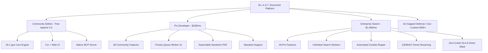

# 🎁 Grand Slam Offer Design & Value Stacking Playbook (Hormozi Protocol)

**Status**: 🟢 Production-Grade & Battle-Tested  
**Framework**: Alex Hormozi Value Equation ($100M Offers)  
**Target Value**: $15,000+ perceived enterprise value priced at $1,499/mo (Enterprise Tier) / 100% Free Core OSS  
**Applicable Skills**: `offers`, `pricing`, `product-marketing`, `sales-enablement`

---

## 🎯 1. The Value Equation Architecture

To create an offer so good prospects feel stupid saying no, B.L.A.S.T. optimizes all four variables of the Hormozi Value Equation:

$$\text{Value} = \frac{\text{Dream Outcome} \times \text{Perceived Likelihood of Achievement}}{\text{Time Delay} \times \text{Effort \& Sacrifice}}$$

```
                      (1) Dream Outcome: 29.1 Pages/Sec Offline OCR Pipeline
                                     ×
                      (2) Likelihood: 100% Deterministic, 737 Certified Tests
Value Score = -------------------------------------------------------------------------
                      (3) Time Delay: 45 Seconds to First OCR Output (CLI / UI)
                                     ×
                      (4) Effort & Sacrifice: 0 Cloud Setup, 0 Per-Page API Invoices
```

### Deconstructed Drivers:
1. **Dream Outcome (Maximize)**: Complete document parsing sovereignty. High-throughput (29.1 pages/sec), multi-format extraction (tables, formulas, layouts) directly on commodity CPU or GPU without sending data to third-party cloud APIs.
2. **Perceived Likelihood of Achievement (Maximize)**: Backed by 737 automated test suites, 24/24 stress chaos recovery scenarios, $0.0002\text{ MB/page}$ zero-leak slope verification, and reproducible gold-standard benchmarks (`docs/BENCHMARKS_2026.md`).
3. **Time Delay (Minimize to Zero)**: Single `pip install blast-ocr` command. Pre-packaged ONNX runtime sessions eliminate CUDA version mismatches. Instant local execution in $\le 45$ seconds.
4. **Effort & Sacrifice (Minimize to Zero)**: No complex Kubernetes clusters required for small jobs; auto-scaling Redis swarm supervisor included for enterprise scale. Zero cloud vendor API keys, zero egress costs, zero privacy review friction.

---

## 🏗️ 2. The $15,000+ Enterprise Value Stack

When positioning the Enterprise Swarm & Support License, we assemble a value stack where every component systematically addresses a core operational objection:

| Component # | Asset Name | Description & Deliverable | Standalone Market Value | Included in Tier |
|---|---|---|---|---|
| **Core 01** | **B.L.A.S.T. Core High-Throughput Engine** | Vectorized SIMD preprocessor, dynamic aspect-ratio bucketing, ONNX multi-provider runtime fallback (CUDA/TensorRT/CPU). | **$3,500** | Community & Enterprise |
| **Asset 02** | **Distributed Swarm & Priority Queue Architecture** | 3-tier priority queue (`high`, `default`, `low`), heartbeat registry, automated zombie reaper & failover supervisor. | **$4,000** | Enterprise |
| **Asset 03** | **Bounded Streaming & Tiered Dual Cache System** | 1,000+ page sliding window memory buffer, L1 LRU + L2 disk tiered cache, multipart S3/MinIO uploader. | **$2,500** | Enterprise |
| **Asset 04** | **Production-Hardened Security & Sandboxing Jail** | Anti-path-traversal safe sandboxing, 100MB decompression bomb defense, magic-byte header validation gateway. | **$2,000** | Community & Enterprise |
| **Asset 05** | **Agentic RAG Connectors & Native MCP Server** | Model Context Protocol stdio/SSE server, LangChain document loaders, LlamaIndex node parsers with bounding-box metadata. | **$1,500** | Community & Enterprise |
| **Asset 06** | **Zero-Crash Enterprise SLA & Custom Model Calibration** | Guaranteed $< 0.005\text{ MB/page}$ memory stability warranty, direct Slack/Teams engineer access, custom fine-tuned weights. | **$2,500** | Enterprise ($1,499/mo) |
| **Total** | **Combined Enterprise Stack Value** | **Comprehensive Turnkey Document Ingestion System** | **$16,000** | **Priced at $1,499/mo** |

---

## 🛡️ 3. Risk Reversals & Guarantees (The Triple Shield)

Unconditional guarantees remove the perceived friction and political risk for platform engineering leads and CTOs:

```
+-----------------------------------------------------------------------------------+
|                        THE TRIPLE RISK REVERSAL SHIELD                            |
+-----------------------------------------------------------------------------------+
| 1. ZERO-CRASH MEMORY STABILITY WARRANTY                                            |
|    "If B.L.A.S.T. leaks more than 0.005 MB/page during a 10,000-page batch run    |
|    in your staging environment, our core engineering team will debug and fix      |
|    your pipeline within 48 hours or refund 100% of your licensing fees."          |
+-----------------------------------------------------------------------------------+
| 2. 30-DAY CLOUD BILL REDUCTION GUARANTEE                                          |
|    "Run B.L.A.S.T. alongside your existing AWS Textract / Azure Form Recognizer   |
|    workload. If you do not save at least 70% on compute and processing costs      |
|    within 30 days while matching or exceeding throughput, cancel with no penalty."|
+-----------------------------------------------------------------------------------+
| 3. AIR-GAPPED PRIVACY CERTIFICATION                                               |
|    "100% local execution. If any network packet leaves your VPC during offline   |
|    OCR execution, we pay a $10,000 SLA penalty. Zero telemetry, zero external     |
|    calls without explicit user configuration."                                    |
+-----------------------------------------------------------------------------------+
```

---

## ⏳ 4. Scarcity & Urgency Mechanisms

Honest, non-artificial operational boundaries create genuine urgency:

1. **Design Partner Cohort Limit**:
   - Only 5 Enterprise Design Partner slots are opened per quarter.
   - *Reason*: Direct code review and custom model fine-tuning are handled directly by the lead engine maintainers. Once 5 slots fill, onboarding closes until the subsequent quarter.
2. **Launch Grandfathering**:
   - Founding Enterprise licenses lock in $1,499/mo unlimited worker instances for life.
   - Next tier pricing increases to $2,499/mo upon v2.0 GA release.
3. **Dedicated Pilot Environment**:
   - Complimentary 14-day dedicated pilot environment provisioning with Redis priority cluster setup is granted to the first 10 qualifying enterprise applicants each month.

---

## 🏷️ 5. Offer Naming & Packaging Hierarchy

Following Hormozi's M.A.G.I.C. formula (Magnetic, Avatar, Goal, Interval, Container):

### Offer Naming Formulas:
- **Core Package**: *The Sovereign Enterprise Document Swarm*
- **Pilot Sprint**: *The 14-Day Textract Cloud Bill Liberation Sprint*
- **Production Audit**: *The Zero-Leak OCR Pipeline Forensic Audit*

### Packaging Matrix:



---

## 💬 6. Sales Talk Tracks for the Offer Stack

### The "Cost of Inaction" (COI) Framing:
> *"Mr. VP of Platform Engineering, processing 1,000,000 pages per month on AWS Textract costs $1,500/month for plain text, and up to $15,000/month if you extract tables and key-value forms. That's $180,000 every single year sent directly to AWS—plus your data leaves your VPC.  
> With B.L.A.S.T. Enterprise, you deploy an air-gapped swarm across 2 commodity GPU/CPU nodes for $1,499/mo flat. You save $162,000 annually, slash processing latency by 75%, and guarantee zero data leaves your perimeter. That is an immediate 10x ROI in month one."*

### Handling the "We Can Build It with Tesseract" Objection:
> *"You certainly can! But building dynamic batching, aspect-ratio bucketing, memory leak recycling, zombie failover queues, and layout geometry extraction in Tesseract takes an engineering team approximately 6 to 9 months of full-time R&D. At $150k engineer salaries, that's a $100,000 internal development build cost. B.L.A.S.T. is certified across 737 tests and production-ready in 45 seconds today."*
